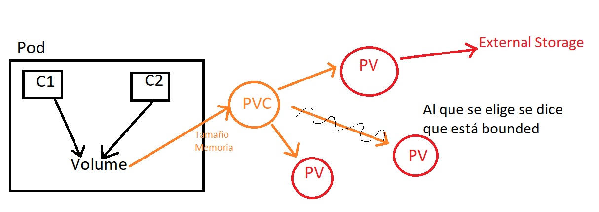

# Explicación de volúmenes

- Diagrama para explicar cómo funcionan los volúmenes en Kubernetes

## Resumiendo

- Los archivos de los contenedores solo viven el tiempo que vivan los contenedores.

- Un primer nivel es crear volúmenes a nivel de Pod para que sobrevivan a los contenedores, aunque no lo harán al Pod.

- Luego tenemos los volúmenes persistentes, que se pueden conectar a almacenamiento externo y pueden existir fuera de los Pods.

- Estos volúmenes persistentes funcionan mediante los Persisten Volume Claims, solicitudes por parte del Pod de tipo y tamaño de memoria.

- Por otro lado tenemos los ConfigMaps, otro objeto de volumen que suele ir de la mano de archivos de configuración  y variables. Es algo más dinámico.

- Por últimos tenemos los Secrets, que es lo mismo pero codificado.

