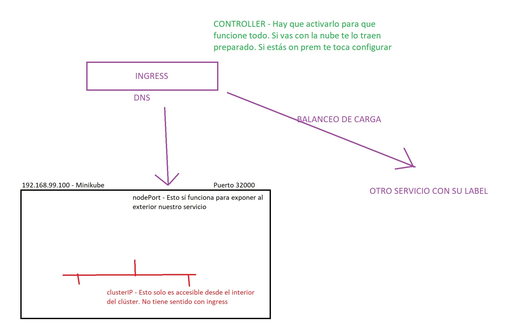

# Explicación de ingress

- Aunque los servicios son los que te exponen al exterior los deployments. Es el ingress los que te lo llevan a internet.

## Propiedades del ingress

- Expone rutas HTTP/HTTPS de nuestros servicios al exterior del cluster.
- Da leyes de routing para el tráfico definidas en el objeto Ingress.
- Se puede configurar para:
    - Dar URLs a los servicios
    - Balancer tráfico
    - Terminar SSL/TLS
    - Hosting virtual basado en nombre

- Necesita de un controller 

## Ingress controller

- Ingress sin ingress controller no funciona nada.

- Has varios controllers:
    - nginx
    - haproxy
    - traefik
    - kong
    - contour

- Para minikube toca:

>> minikube addon enable ingress